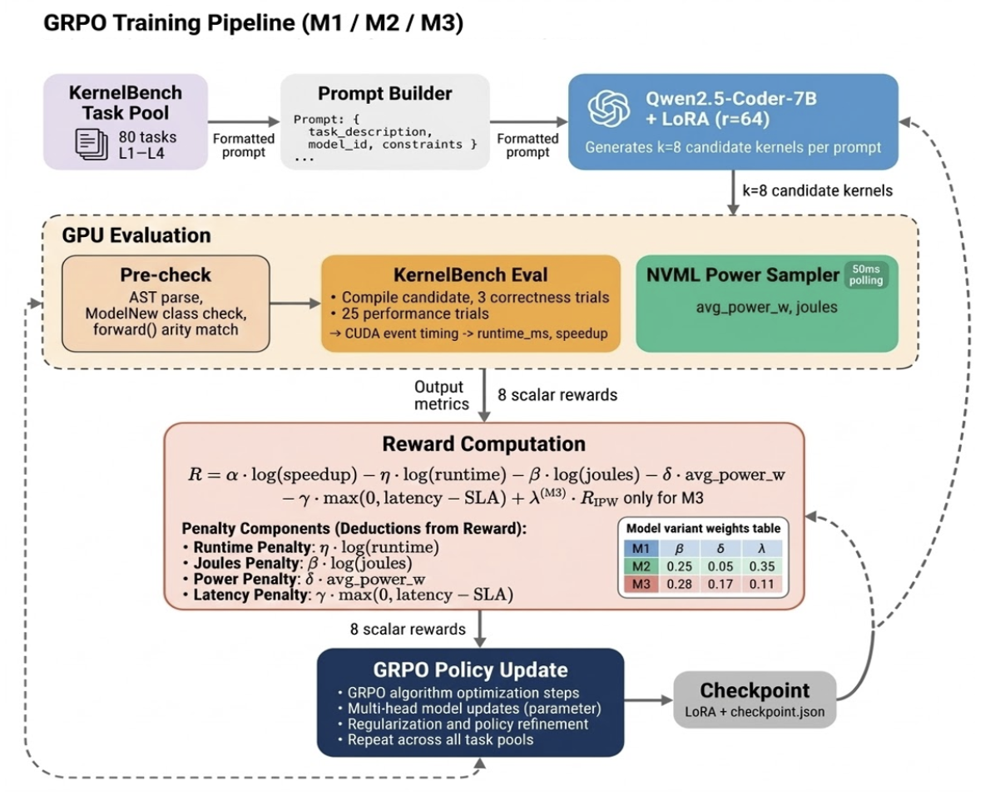
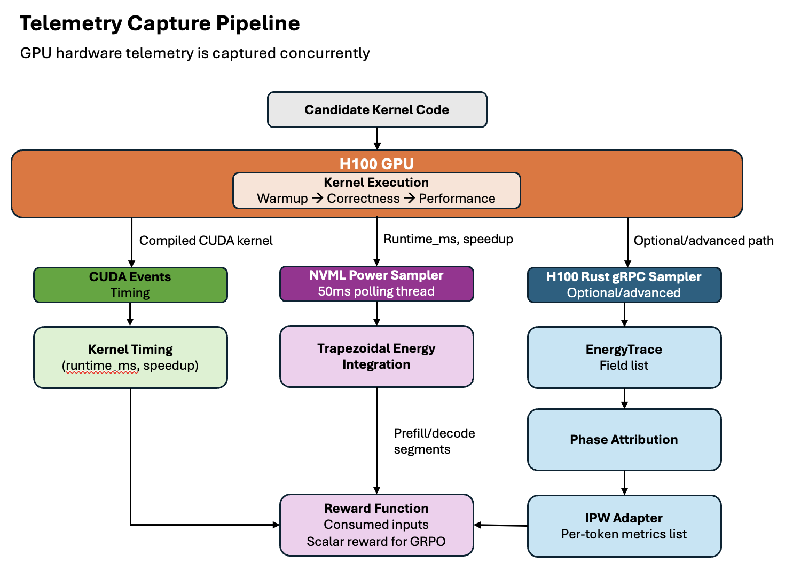

# WARP-K: Watt-Aware Reinforcement Policy for Kernels

WARP-K is a research framework for co-optimizing GPU kernel code generation and runtime controls for energy efficiency. It combines three reinforcement learning tracks:

1. **Kernel-only RL** -- correctness and throughput via GRPO on Qwen2.5-Coder-7B.
2. **Energy-aware kernel RL** -- adds joules, power, and IPW (intelligence-per-watt) to the reward signal.
3. **Hierarchical RL** -- alternates kernel generation (GRPO) and runtime control (PPO) under SLA constraints.

### System Architecture

| GRPO Training Pipeline | Telemetry Capture Pipeline |
|:---:|:---:|
|  |  |

---

## Table of Contents

- [Repository Structure](#repository-structure)
- [Setup and Installation](#setup-and-installation)
- [Quick Reproduction](#quick-reproduction)
- [Model Experiments](#model-experiments)
  - [M0: SFT Baseline](#m0-sft-baseline)
  - [M1: Throughput GRPO](#m1-throughput-grpo)
  - [M2: Energy-Aware GRPO](#m2-energy-aware-grpo)
  - [M3: IPW-Blend GRPO](#m3-ipw-blend-grpo)
  - [M4: Runtime PPO](#m4-runtime-ppo)
  - [M5: Hierarchical RL](#m5-hierarchical-rl)
- [Evaluation Suite](#evaluation-suite)
- [Paper Artifact Generation](#paper-artifact-generation)
- [Reusable Components](#reusable-components)
- [Environment Variables Reference](#environment-variables-reference)
- [Testing](#testing)
- [Configuration](#configuration)

---

## Repository Structure

```
KITE-Kernel-Intelligence/
  src/kite/               Core Python package
    adapters/               KernelBench and IPW data adapters
    envs/                   RL environments (kernel, runtime, hierarchical)
    measurement/            Timing and energy measurement protocols
    policies/               Qwen policy, runtime actor-critic, HRL controller
    rewards/                Composable reward functions (kernel, energy, HRL, IPW)
    telemetry/              GPU energy capture, phase attribution
    trainers/               SFT, GRPO, PPO, and HRL trainers
    eval/                   Benchmark runner, ablations, reports
    utils/                  Logging, seeds, serialization

  scripts/                Pipeline scripts (see scripts/README.md)
    setup/                  Conda env creation, source sync, data build
    training/               Per-model training (M0-M5)
    experiments/            31 experiment runners matching results/h100/
    eval/                   Standalone evaluation and baselines
    analysis/               Synthetic data, paper figures/tables
    inference/              Multiturn inference optimization
    agents/                 Multi-agent cloud orchestration

  configs/                YAML configuration files
    training/               Per-model training configs (m0-m5)
    exp/                    Per-experiment configs (31 experiments x 3 seeds)

  tools/
    h100-energy-sampler/    Rust-based GPU telemetry service (NVML + gRPC)

  external/
    KernelBench/            ICML '25 kernel generation benchmark
    ipw_internal/           Intelligence-per-Watt profiling framework

  results/h100/2026-03/   Experiment results (31 directories)
  tests/                  Test suite (17 test files)
  docs/                   Design docs, experiment guide, env specs
  envs/                   Conda environment YAML specs
```

---

## Setup and Installation

### Prerequisites

- **conda** (Miniconda or Anaconda)
- **CUDA 12.4** with NVIDIA driver 550+ (for GPU training)
- **Rust toolchain** (for the H100 energy sampler, optional)
- **Python 3.11+**

### 1. Clone and Initialize

```bash
git clone <repo-url> KITE-Kernel-Intelligence
cd KITE-Kernel-Intelligence

git clone https://github.com/ScalingIntelligence/KernelBench.git external/KernelBench
ln -s /path/to/ipw_internal external/ipw_internal   # optional
```

### 2. Conda Environments

Three environments target different workflows:

| Environment | Python | Purpose |
|-------------|--------|---------|
| `kite-core` | 3.11 | Development, tests, data prep |
| `kite-train` | 3.11 | RL/SFT training (torch, transformers, peft, trl) |
| `kite-telemetry` | 3.13 | Energy capture (pynvml, grpcio, IPW) |

```bash
# Core environment only
bash scripts/setup/setup_conda_envs.sh

# All environments + IPW integration
bash scripts/setup/setup_conda_envs.sh --all --with-ipw
```

Verify external sources and GPU:

```bash
bash scripts/setup/01_sync_sources.sh
```

### 3. HuggingFace Model Cache

Set a persistent cache path to avoid repeated downloads across runs and nodes:

```bash
export KITE_HF_CACHE=/path/to/hf-cache
mkdir -p "$KITE_HF_CACHE"

# One-time download
conda run -n kite-train python -c "
from transformers import AutoModelForCausalLM, AutoTokenizer
m = 'Qwen/Qwen2.5-Coder-7B-Instruct'
AutoTokenizer.from_pretrained(m, cache_dir='$KITE_HF_CACHE', trust_remote_code=True)
AutoModelForCausalLM.from_pretrained(m, cache_dir='$KITE_HF_CACHE', trust_remote_code=True)
"

# Optional offline mode after warm-up
export KITE_HF_LOCAL_FILES_ONLY=1
```

### 4. Build the H100 Energy Sampler (Optional)

The Rust-based GPU telemetry service streams NVML metrics over gRPC. Required only for real energy measurement on NVIDIA GPUs.

```bash
cd tools/h100-energy-sampler
cargo build --release

# Start the gRPC telemetry server
cargo run --release -- --mode stream --addr 0.0.0.0:50052
```

### 5. Build Dataset

```bash
conda activate kite-train
python scripts/setup/02_build_dataset.py
```

---

## Quick Reproduction

Run the full pipeline from source sync through evaluation and paper artifacts:

```bash
bash scripts/reproduce.sh
```

Or run all 31 experiments individually:

```bash
bash scripts/experiments/run_all_experiments.sh

# Preview without executing
bash scripts/experiments/run_all_experiments.sh --dry-run
```

---

## Model Experiments

### M0: SFT Baseline

Supervised fine-tuning of Qwen2.5-Coder-7B-Instruct with LoRA on KernelBench tasks. Establishes the baseline compile rate, correctness, and energy profile.

| Experiment | Config | Description |
|------------|--------|-------------|
| `kernel_generation_baseline` | `configs/exp/kernel_generation_baseline/` | Standard SFT eval |
| `single_shot_generation` | `configs/exp/single_shot_generation/` | Single-shot (1 turn) |
| `multiturn_generation` | `configs/exp/multiturn_generation/` | Multiturn (5 turns) |

```bash
# Train M0
python scripts/training/train_m0_sft.py --config configs/training/m0_sft.yaml

# Run M0 experiment
python scripts/experiments/03_run_sft.py \
    --config configs/exp/kernel_generation_baseline/seed{seed}.yaml
```

**Expected ranges:** compile ~0.86, correctness ~0.48-0.57, runtime ~21-24ms, joules ~5.8-7.1

### M1: Throughput GRPO

Group Relative Policy Optimization targeting throughput only (no energy terms in reward). Improves correctness and speedup over M0 at the cost of higher power draw.

```bash
# Train M1
python scripts/training/train_m1_throughput_grpo.py --config configs/training/m1_throughput.yaml

# Run experiment
python scripts/training/train_rl.py \
    --config configs/exp/throughput_rl/seed{seed}.yaml
```

**Expected ranges:** correctness ~0.67, pass@k ~0.79, runtime ~18.2ms, power ~277W

### M2: Energy-Aware GRPO

Adds energy penalty terms (`reward_beta_joules=0.5`, `reward_delta_avg_power=0.01`) to the GRPO reward. Achieves similar correctness to M1 with significantly lower energy consumption.

```bash
python scripts/training/train_m2_energy_grpo.py --config configs/training/m2_energy.yaml
```

**Expected ranges:** correctness ~0.65, joules ~4.4 (34% lower than M1), power ~205W

### M3: IPW-Blend GRPO

Blends an IPW (Intelligence Per Watt = throughput/power) reward signal with the energy-aware reward via `ipw_blend_weight`. The sweep tests weights `[0.0, 0.1, 0.25, 0.5]`.

```bash
python scripts/training/train_m3_ipw_blend_grpo.py --config configs/training/m3_ipw_blend.yaml
```

**Expected ranges:** joules ~3.8-4.0 (lowest), power ~175-179W (lowest), reward ~10.3

### M4: Runtime PPO

PPO-trained runtime control policy that adjusts power caps, DVFS profiles, and concurrency. Three operating regimes:

| Regime | SLA Targets | Runtime |
|--------|------------|---------|
| Latency-sensitive | TTFT p95 <= 1s, E2E <= 15s | ~15.1ms |
| Throughput | TTFT p95 <= 5s, E2E <= 60s | ~16.1ms |
| Mixed | TTFT p95 <= 2s, E2E <= 30s | ~16.8ms |

```bash
python scripts/training/train_m4_runtime_ppo.py --config configs/training/m4_runtime.yaml
python scripts/experiments/06_run_runtime_ppo.py \
    --config configs/exp/regime_latency_sensitive/seed{seed}.yaml
```

### M5: Hierarchical RL

Alternating training: kernel GRPO rounds followed by runtime PPO rounds, then joint fine-tuning. Combines the benefits of energy-efficient kernels with adaptive runtime control.

```bash
python scripts/training/train_m5_hrl.py --config configs/training/m5_hrl.yaml
python scripts/experiments/07_run_hrl.py \
    --config configs/exp/hierarchical_control/seed{seed}.yaml
```

**Expected ranges:** runtime ~15.8ms, joules ~3.8, reward ~10.0

---

## Evaluation Suite

The `08_eval_all.py` runner executes 20 evaluation experiments across all models. Each experiment produces a standardized output directory under `results/h100/<date>/<experiment_name>/`.

| Category | Experiments |
|----------|-------------|
| **Cross-model comparison** | `single_shot_vs_multiturn`, `matched_runtime_different_energy`, `throughput_vs_energy_vs_ipwblend` |
| **Generalization** | `cross_hardware_transfer`, `heldout_generalization`, `difficulty_stratified_eval` |
| **Ablations** | `reward_ablation`, `data_scale_ablation`, `inference_budget_ablation`, `telemetry_realism_ablation` |
| **Robustness** | `seed_robustness`, `measurement_repeatability` |
| **Analysis** | `failure_taxonomy`, `final_eval_suite` |
| **Paper artifacts** | `paper_figures`, `paper_tables`, `paper_appendix`, `paper_artifacts` |

```bash
# Run one eval experiment
python scripts/experiments/08_eval_all.py \
    --config configs/exp/cross_hardware_transfer/seed{seed}.yaml

# Run all 31 experiments at once
bash scripts/experiments/run_all_experiments.sh
```

Each output directory contains:
- `logs/<name>_run.log` -- structured run log with per-seed metrics
- `<name>_metrics.csv` -- per-task metrics (80 tasks x 3 seeds)
- `<name>_per_task.jsonl` -- detailed per-task records
- `<name>_per_seed.csv` -- seed-level aggregates
- `<name>_summary.json` -- experiment summary with aggregate metrics
- `<name>_ci_stats.json` -- confidence intervals
- `<name>_significance_tests.csv` -- statistical tests
- `plot_data/` -- CSV data for figures

See [docs/EXPERIMENTS.md](docs/EXPERIMENTS.md) for the full experiment catalog.

---

## Paper Artifact Generation

After experiments complete, generate all figures and tables for the paper:

```bash
# Step 1: Generate synthetic per-task data from run logs
python scripts/analysis/generate_h100_target_synthetic_results.py \
    --results-root results/h100/2026-03

# Step 2: Render figures and tables
python scripts/analysis/build_h100_paper_artifacts.py \
    --results-root results/h100/2026-03

# Step 3: Build the paper artifacts bundle
python scripts/experiments/09_build_paper_artifacts.py \
    --results-root results/h100/2026-03
```

Outputs appear in `results/h100/2026-03/paper_outputs/` with 8 main figures, 9 appendix figures, and 14 tables.

---

## Reusable Components

Several KITE modules are designed for reuse in other GPU optimization, energy measurement, or RL-for-code-generation projects.

### GPU Energy Capture (`src/kite/telemetry/energy_capture.py`)

Drop-in energy measurement wrapper for arbitrary GPU workloads. Supports real NVML telemetry via the H100 gRPC sampler or synthetic fallback.

```python
from kite.telemetry.energy_capture import EnergyCapture

capture = EnergyCapture()
trace = capture.capture(kernel_fn=my_gpu_kernel)
print(f"Energy: {trace.total_joules:.2f} J, Power: {trace.avg_power_w:.1f} W")
```

### Rust H100 Energy Sampler (`tools/h100-energy-sampler/`)

Standalone Rust gRPC service that streams 11 NVML metrics at configurable intervals. Can be used independently of KITE for any GPU telemetry need.

Collected metrics: GPU utilization, memory utilization, temperature, SM clock, memory clock, power limit, total energy consumption, memory usage, PCIe throughput, throttle reasons, fan speed.

```bash
cargo run --release -- --mode stream --addr 0.0.0.0:50052 --interval-ms 100
```

### Composable Reward Functions (`src/kite/rewards/`)

Multi-objective reward functions with individually tunable weights. Supports correctness, speedup, runtime, energy, power, SLA, and IPW terms.

```python
from kite.rewards.grpo_reward import GRPOMultiMetricRewardConfig, compute_grpo_multi_metric_reward

config = GRPOMultiMetricRewardConfig(
    alpha_speedup=1.0,
    beta_joules=0.5,
    delta_avg_power=0.01,
)
reward = compute_grpo_multi_metric_reward(candidate, config)
```

### Measurement Protocols (`src/kite/measurement/`)

Standardized timing and energy measurement with warmup, repeated trials, and statistical aggregation.

```python
from kite.measurement.protocol import measure_candidate

result = measure_candidate(kernel_fn, num_trials=25, warmup=5)
```

### Phase Attribution (`src/kite/telemetry/phase_attribution.py`)

Separates prefill and decode energy contributions from a telemetry trace, enabling per-phase energy analysis for autoregressive models.

```python
from kite.telemetry.phase_attribution import attribute_prefill_decode

phases = attribute_prefill_decode(energy_trace, token_timestamps)
```

### Grouped RL Rollouts (`src/kite/adapters/kevin_style_rollouts.py`)

Implements grouped rollout generation and trajectory filtering for GRPO-style training, independent of any specific policy or environment.

```python
from kite.adapters.kevin_style_rollouts import RolloutConfig, grouped_rollouts

config = RolloutConfig(group_size=8, keep_top_k=4)
trajectories = grouped_rollouts(policy, tasks, config)
```

---

## Environment Variables Reference

All KITE-specific environment variables in one place. Export these in your shell profile (e.g. `~/.bashrc`, `~/.zshrc`) or at the top of a SLURM job script so every script, trainer, and agent picks them up automatically.

```bash
# ── Required ──────────────────────────────────────────────────────────────

# Directory where HuggingFace model weights are cached.
# Avoids re-downloading across runs and cluster nodes.
export KITE_HF_CACHE="$HOME/.cache/kite-hf"
mkdir -p "$KITE_HF_CACHE"

# ── Recommended ───────────────────────────────────────────────────────────

# Set to 1 after the first download to prevent any network access
# during training/eval (ensures full reproducibility on air-gapped nodes).
export KITE_HF_LOCAL_FILES_ONLY=1

# Conda environment name used by agent scripts and orchestrators.
# Defaults to kite-train if unset.
export KITE_CONDA_ENV=kite-train

# ── GPU Selection ─────────────────────────────────────────────────────────

# Standard CUDA variable. Limits visible GPUs for training and evaluation.
# Multi-GPU scripts (e.g. multiturn_optimize_multi_gpu.py) set this per-worker.
export CUDA_VISIBLE_DEVICES=0,1,2,3

# ── Generation / CLI Overrides ────────────────────────────────────────────

# Controls the kernel generation backend used by `kite.cli`.
# Options: stub (default, synthetic), model (real Qwen inference).
export KITE_GENERATION_MODE=stub

# Inference server type. Options: local (default), vllm.
export KITE_SERVER_TYPE=local

# Override the default model name (Qwen/Qwen2.5-Coder-7B-Instruct).
export KITE_MODEL_NAME="Qwen/Qwen2.5-Coder-7B-Instruct"

# ── Plotting / Artifact Generation ────────────────────────────────────────

# Set to 1 to skip matplotlib imports in build_h100_paper_artifacts.py.
# Useful on headless servers where numpy/matplotlib may segfault.
export KITE_NO_PLOTS=0

# ── Python Path ───────────────────────────────────────────────────────────

# Ensures the kite package is importable from anywhere.
export PYTHONPATH="${PYTHONPATH:+$PYTHONPATH:}$(pwd)/src"
```

**Quick copy-paste block** -- paste this into your terminal to set everything at once with sensible defaults:

```bash
export KITE_HF_CACHE="$HOME/.cache/kite-hf"
export KITE_HF_LOCAL_FILES_ONLY=1
export KITE_CONDA_ENV=kite-train
export KITE_GENERATION_MODE=stub
export KITE_SERVER_TYPE=local
export KITE_MODEL_NAME="Qwen/Qwen2.5-Coder-7B-Instruct"
export KITE_NO_PLOTS=0
export PYTHONPATH="${PYTHONPATH:+$PYTHONPATH:}$(pwd)/src"
mkdir -p "$KITE_HF_CACHE"
```

| Variable | Required | Default | Used By |
|----------|----------|---------|---------|
| `KITE_HF_CACHE` | Yes | `~/.cache/kite-hf` | All trainers, inference scripts, `QwenPolicy` |
| `KITE_HF_LOCAL_FILES_ONLY` | No | `0` | All trainers, inference scripts (offline mode) |
| `KITE_CONDA_ENV` | No | `kite-train` | Agent scripts (`scripts/agents/`) |
| `CUDA_VISIBLE_DEVICES` | No | all GPUs | Trainers, eval, Rust sampler, multi-GPU inference |
| `KITE_GENERATION_MODE` | No | `stub` | `kite.cli` kernel generation backend |
| `KITE_SERVER_TYPE` | No | `local` | `kite.cli` inference server type |
| `KITE_MODEL_NAME` | No | `Qwen/Qwen2.5-Coder-7B-Instruct` | `kite.cli` model override |
| `KITE_NO_PLOTS` | No | `0` | `build_h100_paper_artifacts.py` |
| `PYTHONPATH` | Recommended | -- | Ensures `import kite` works outside conda env |

---

## Testing

```bash
conda activate kite-core

# Run the full test suite
pytest tests/ -v

# Run specific test categories
pytest tests/test_rust_sampler.py -v          # Rust sampler structural tests
pytest tests/test_h100_pipeline.py -v         # H100 experiment pipeline tests
pytest tests/test_grpo_reward.py -v           # Reward function tests
pytest tests/test_energy_reward.py -v         # Energy reward tests
pytest tests/test_hrl_alternating_schedule.py # HRL schedule tests
```

---

## Configuration

### Training Configs (`configs/training/`)

One YAML per model: `m0_sft.yaml`, `m1_throughput.yaml`, `m2_energy.yaml`, `m3_ipw_blend.yaml`, `m4_runtime.yaml`, `m5_hrl.yaml`.

### Experiment Configs (`configs/exp/`)

31 experiment directories, each with `seed11.yaml`, `seed22.yaml`, `seed33.yaml`. Configs specify the script, model tag, stage, and experiment-specific hyperparameters.

### Hardware and Reward Configs (`configs/`)

- `hardware_h100.yaml` -- GPU hardware profile
- `reward_kernel.yaml` -- kernel reward weights
- `reward_hrl.yaml` -- HRL reward weights
- `slas.yaml` -- SLA thresholds

See [docs/DESIGN.md](docs/DESIGN.md) for architecture details and [docs/ENVIRONMENTS.md](docs/ENVIRONMENTS.md) for the full environment setup matrix.
